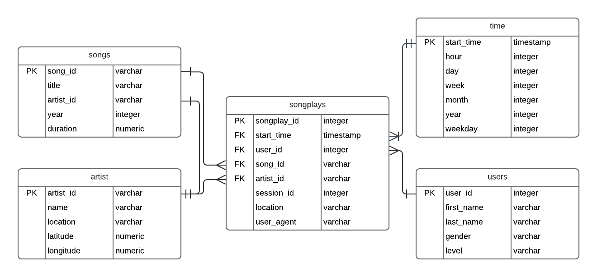

## Project Overview
A startup called Sparkify wants to analyze the data they've been collecting on songs and user activity on their new music streaming app. The analytics team is particularly interested in understanding what songs users are listening to. Currently, they don't have an easy way to query their data, which resides in a directory of JSON logs on user activity on the app, as well as a directory with JSON metadata on the songs in their app.

They'd like a data engineer to create a Postgres database with tables designed to optimize queries on song play analysis, and bring you on the project. Your role is to create a database schema and ETL pipeline for this analysis. You'll be able to test your database and ETL pipeline by running queries given to you by the analytics team from Sparkify and compare your results with their expected results.


## Project Repository

### Log Data
This dataset consists of log files in JSON format generated by an event simulator.

The log files in the dataset partitioned by year and month.

data/log_data/YYYY/MM/YYYY-MM-DD-events.json

### Song Data

This dataset is a subset of real data from the Million Song Dataset. Each file is in JSON format and contains metadata about a song and the artist of that song. The files are partitioned by the first three letters of each song's track ID.

song_data/A/B/C/TRABCEI128F424C983.json

### Notebooks

The juptyer notebooks in the repository were used for testing and to assist in the process of generating the ETL scripts.

### Python ETL Scripts

create_tables.py drops and creates the tables.

etl.py reads and processes files from song_data and log_data and loads them into your tables.

sql_queries.py contains all the sql queries for creating, inserting into, and dropping tables.


## Database Design

The Postgres database contains tables following the star schema.



The songplays fact table contains records from log data associated with song plays.

Any additional information regarding a user, song, artist, or time is needed it can be found in its appropriate dimension table.

users dimension table - users in the app

songs dimension table - songs in music database

artists dimension table - artists in music database

time dimension table - timestamps of records in songplays broken down into specific units

### Example query
Count the number of songs a user listens to on the weekday vs on the weekend

```select u.user_id, sum(t.weekday) as "weekday", \
sum(case when t.weekday = 0 then 1 else 0 end) as "weekend" \
from songplays s \
join users u on (u.user_id = s.user_id) \
join time t on (t.start_time = s.start_time) \
group by u.user_id;
```

## ETL Design
The music streaming logs and song library exist within appropriate subdirectories on the local machine.  These json files were read in leveraging the pandas library.  

For each file and each json object, the required fields were parsed.  Values were transformed if necessary based on schema requirements and inserted into the appropriate table..

`python etl.py`

### Execution

#### How to Run the Project

Run create_tables.py to create the tables.

`python create_tables.py`

etl.py reads and processes files from song_data and log_data and loads them into the tables.

`python etl.py`
