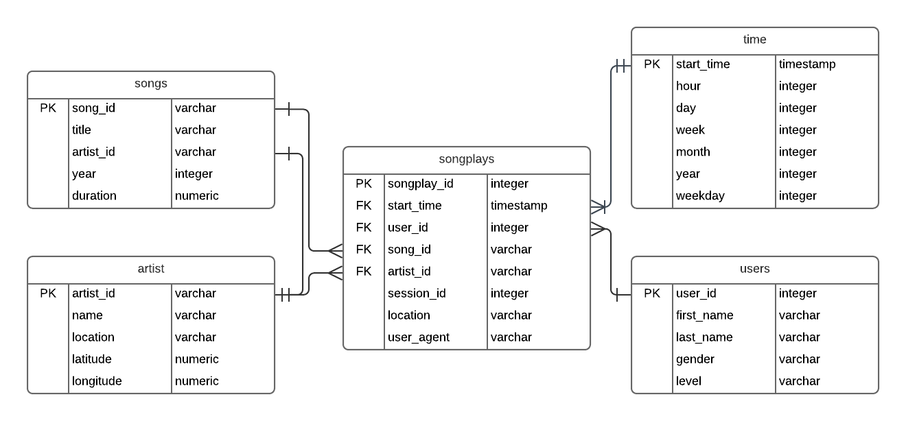

## Project Overview
A music streaming startup, Sparkify, has grown their user base and song database and want to move their processes and data onto the cloud. Their data resides in S3, in a directory of JSON logs on user activity on the app, as well as a directory with JSON metadata on the songs in their app.

As their data engineer, you are tasked with building an ETL pipeline that extracts their data from S3, stages them in Redshift, and transforms data into a set of dimensional tables for their analytics team to continue finding insights in what songs their users are listening to. You'll be able to test your database and ETL pipeline by running queries given to you by the analytics team from Sparkify and compare your results with their expected results.

## S3 Data

### Log Data
This dataset consists of log files in JSON format generated by an event simulator.

The log files are located at the top level key s3://udacity-dend/log_data.

The keys in the dataset are partitioned by year and month, and the file contains all events for a specific date.

For example:

aws s3 ls s3://udacity-dend/log_data/2018/11/2018-11-01-events.json

The file s3://udacity-dend/log_json_path.json is used to define the JSON schema.

### Song Data

This dataset is a subset of real data from the Million Song Dataset. Each file is in JSON format and contains metadata about a song and the artist of that song.

The song files are located at the top level key s3://udacity-dend/song_data.

The keys in the dataset are partitioned by the first three letters of each song's track ID.

For example:

s3://udacity-dend/song_data/A/A/A/TRAAAAK128F9318786.json

song_data/A/B/C/TRABCEI128F424C983.json

## Database Design

The Redshift database contains tables following the star schema.

The songplays fact table contains records from log data associated with song plays.

Any additional information regarding a user, song, artist, or time is needed it can be found in its appropriate dimension table.

users dimension table - users in the app

songs dimension table - songs in music database

artists dimension table - artists in music database

time dimension table - timestamps of records in songplays broken down into specific units

### Python ETL Scripts

create_tables.py drops and creates the staging, fact, and dimension tables in Redshift.

etl.py will copy the S3 files into Redshift staging tables and insert data from the staging tables into the dimension and fact tables.

sql_queries.py contains all the sql queries for creating, inserting into, and dropping tables.

### Execution

#### How to Run the Project

Run create_tables.py to create the tables in Redshift.

`python create_tables.py`

Run etl.py to populate the tables in Redshift.

`python etl.py`
